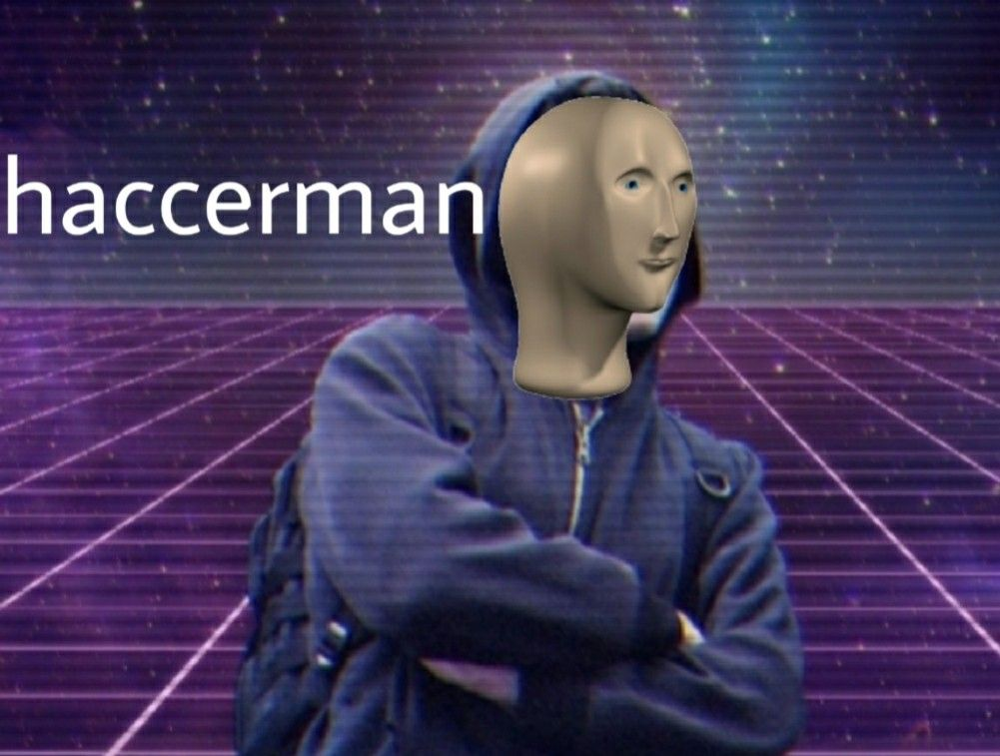

# Домашнее задание #3

# Инструкция по работе с Git и удаленными репозитариями 

## Что такое Git?

**Git** - _**это распределенная система управления версиями.**_ Это означает, что локальный клон проекта является полным репозиторием управления версиями. Полнофункциональные локальные репозитории упрощают работу в автономном режиме или в удаленном расположении. Разработчики фиксируют свою работу локально, а затем синхронизируют свою копию репозитория с копией на сервере.*

**Репозиторий Git или репозиторий** — _**это папка, в которую Git отслеживает изменения**. На компьютере может быть любое количество репозиториев, каждое из которых хранится в собственной папке. Каждый репозиторий Git в системе является независимым, поэтому изменения, сохраненные в одном репозитории Git, не влияют на содержимое другого.
Репозиторий Git содержит каждую версию каждого файла, сохраненного в репозитории._

# Основные команды Git
**Эти основные команды помогут Вам познакомиться с азами работы с Git**
* git init – инициализация локального репозитория
* git status – получить информацию от git о его текущем состоянии
* git add – добавить файл или файлы к следующему коммиту
* git commit -m “message” – создание коммита.
* git log – вывод на экран истории всех коммитов с их хеш-кодами
* git checkout – переход от одного коммита к другому
* git checkout master – вернуться к актуальному состоянию и продолжить работу
* git diff – увидеть разницу между текущим файлом и закоммиченным файлом

# Синтаксис языка Markdown

*       *Справочник по Markdown от Microsoft: https://docs.microsoft.com/ru-ru/contribute/markdown-reference

* "#" Заголовок – выделение заголовков. Количество символов “#” задаёт уровень заголовка
(поддерживается 6 уровней).
* "=" или "-" – подчёркиванием этими символами (не менее 3 подряд) выделяют заголовки первого
(“=”) и второго (“-”) уровней.
* **" Полужирное начертание "** или __ Полужирное начертание__ - обозначается двойными знаками "*" или "_"
* *Курсивное начертание* или _Курсивное начертание_ - обозначается одинарным знаками "*" или "_"
* **_Полужирное курсивное начертание_** - обозначается символами "**_" в начале желаемого текста и в конце
* ~~Зачёркнутый текст~~ - обозначается символами "~~" в начале желаемого текста и в конце
*  Строка – ненумерованные списки, символ “*” в начале строки
* 1, 2, 3 … – нумерованные списки, символ “1.”, "2." в начале строки

 

Готово